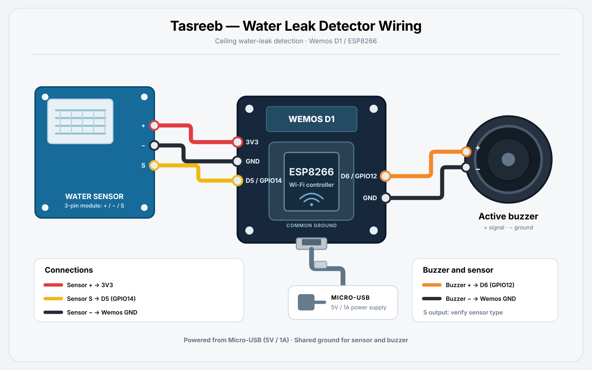

<div align="center">

# 💧 Tasreeb — IoT Ceiling Water Leakage Detection & Alert System

[](https://isocpp.org/)
[](https://www.espressif.com/en/products/socs/esp8266)
[](https://www.arduino.cc/)
[](https://en.wikipedia.org/wiki/Internet_of_things)
[](https://core.telegram.org/bots/api)
[](LICENSE)
[](#-firmware--deployment-guide)

**A low-cost, always-on ESP8266 node that detects water leaking through a ceiling or roof slab, raises an immediate local siren, and pushes an instant Telegram alert to your phone — then confirms automatically when the leak clears.**

Built to catch slab seepage and A/C drain-pan overflow *before* it reaches drywall, wiring, or furniture.

</div>

---

## 📑 Table of Contents

- [Overview](#-overview)
- [Key Features](#-key-features)
- [System Architecture](#️-system-architecture)
  - [Hardware ↔ Software Interaction Flow](#hardware--software-interaction-flow)
- [Bill of Materials (BOM)](#-bill-of-materials-bom)
- [Wiring Guide & Pinout Mapping](#-wiring-guide--pinout-mapping)
- [Prerequisites & Library Installation](#-prerequisites--library-installation)
- [Telegram Bot Setup Guide](#-telegram-bot-setup-guide)
- [Firmware & Deployment Guide](#-firmware--deployment-guide)
- [Source Code](#-source-code)
- [System Testing & Operation Flow](#-system-testing--operation-flow)
  - [Troubleshooting Matrix](#troubleshooting-matrix)
- [Future Enhancements / Roadmap](#️-future-enhancements--roadmap)
- [License](#-license)
- [Acknowledgments](#-acknowledgments)

---

## 🔍 Overview

Ceiling and roof-slab leaks are notoriously expensive because they are *discovered late* — usually once a stain has already bloomed across the plaster, or water has tracked into an electrical conduit. The repair bill is dominated not by the water itself but by the detection delay.

**Tasreeb** closes that gap. A water-leak sensor module is mounted at the drip point — under a suspect slab, inside a false-ceiling void, or beneath an A/C drain pan. The moment its conductive probe bridges, a Wemos D1 (ESP8266) fires two independent alert channels:

| Channel | Purpose | Latency |
|:--|:--|:--|
| **Local** — active buzzer, intermittent 2.5 Hz pattern | Wakes anyone on-site; works even if the internet is down | < 1 s |
| **Remote** — Telegram push notification | Reaches the owner or facility manager anywhere in the world | 1–3 s (network dependent) |

A single-shot latch (`alertActive`) guarantees exactly **one** alert message per leak event — no notification storms — and a second **auto-recovery message** is sent automatically once the sensor dries out, so you always know the current state without polling the device.

> [!NOTE]
> The firmware's user-facing Telegram messages are written in **Arabic**, matching the deployment region this project was built for. All identifiers, comments, and this documentation are in English. The message strings are plain `String` literals inside `setup()` and `loop()` and can be localized in seconds — see [Localizing the Alert Messages](#localizing-the-alert-messages).

---

## ✨ Key Features

- **⚡ Real-Time Digital Leak Monitoring** — The sensor module's digital output (`DO`) is polled on `D5` every 500 ms. Detection-to-alarm latency is sub-second, with no cloud round-trip required for the local siren.

- **🔔 Intermittent Local Audio Alert** — An active buzzer on `D6` is driven in a `200 ms ON / 200 ms OFF` pulse train. The intermittent pattern is deliberate: a pulsed tone is measurably more attention-grabbing than a continuous one, and far easier to localize by ear in a large space than a steady drone.

- **📲 Instant Telegram Push Notification** — Alerts are delivered through the official [Telegram Bot API](https://core.telegram.org/bots/api) via the `UniversalTelegramBot` library. No third-party broker, no MQTT server, no subscription fee, and no port forwarding — the device only ever makes *outbound* HTTPS connections.

- **♻️ Automatic Recovery / All-Clear Alert** — When the sensor returns to its dry state, the buzzer is silenced and a status-restored message is pushed automatically. This turns the device from a one-shot alarm into a genuine *state reporter*.

- **🔒 SSL/TLS Transport** — Telegram's API is HTTPS-only. The firmware uses `WiFiClientSecure` with `client.setInsecure()`, which performs full TLS encryption while skipping X.509 certificate-chain verification — the standard pragmatic trade-off on the ESP8266, where storing and rotating a CA root costs scarce flash and breaks whenever Telegram rotates its certificate. See the [security note](#a-note-on-setinsecure).

- **🛡️ Single-Shot Alert Latching** — The `alertActive` boolean acts as an edge detector, so a leak that persists for six hours produces one alert message rather than 43,200 of them. This protects both your notification sanity and Telegram's API rate limits.

- **💵 Ultra Low Cost & Low Power** — The complete node costs well under **$10** and draws roughly **70–80 mA** idle, so it runs indefinitely from any spare 5 V USB phone charger.

- **🚀 Zero-Infrastructure Deployment** — Flash, plug in, done. No broker to host, no dashboard to maintain, no static IP, and no inbound firewall rules.

---

## 🏗️ System Architecture

The design is intentionally a **flat, single-threaded, state-latched polling loop**. For a safety-critical binary alarm, that is a feature rather than a limitation: there is no scheduler, no task queue, and no interrupt context to reason about, which makes every failure mode trivially auditable.

```text
        ┌─────────────────────────────────────────────────────────────────┐
        │                        PHYSICAL LAYER                           │
        │                                                                 │
        │    Water on ceiling / slab / A/C drain pan                      │
        │                        │                                        │
        │                        ▼                                        │
        │        ┌───────────────────────────────┐                        │
        │        │   Water Leak Sensor Module    │                        │
        │        │   (conductive probe + LM393)  │                        │
        │        │   VCC · GND · DO ───────────┐ │                        │
        │        └─────────────────────────────┼─┘                        │
        └──────────────────────────────────────┼──────────────────────────┘
                                               │  Digital signal (HIGH = wet)
                                               ▼
        ┌─────────────────────────────────────────────────────────────────┐
        │              CONTROLLER LAYER — Wemos D1 (ESP8266)              │
        │                                                                 │
        │   D5 (GPIO14) ──► digitalRead()                                 │
        │                        │                                        │
        │                        ▼                                        │
        │            ┌───────────────────────┐                            │
        │            │   State Machine       │                            │
        │            │   bool alertActive    │  ◄── edge-detect latch     │
        │            └───────┬───────┬───────┘                            │
        │                    │       │                                    │
        │       ┌────────────┘       └────────────┐                       │
        │       ▼                                 ▼                       │
        │  D6 (GPIO12) ──► Buzzer            WiFiClientSecure             │
        │                  200 ms / 200 ms   (TLS 1.2, setInsecure)       │
        └───────┬─────────────────────────────────────┬───────────────────┘
                │                                     │
                ▼                                     ▼
        ┌───────────────────┐              ┌────────────────────────────┐
        │  LOCAL ALERT      │              │   NETWORK LAYER            │
        │  Active Buzzer    │              │   Wi-Fi 802.11 b/g/n       │
        │  On-site,         │              │        │                   │
        │  offline-capable  │              │        ▼                   │
        └───────────────────┘              │   api.telegram.org :443    │
                                           │        │                   │
                                           │        ▼                   │
                                           │   Telegram Client          │
                                           │   (phone / group chat)     │
                                           └────────────────────────────┘
```

### Hardware ↔ Software Interaction Flow

| # | Layer | Actor | Action |
|:-:|:--|:--|:--|
| 1 | Physical | Water droplet | Bridges the two interleaved traces of the probe PCB, dropping its resistance from ~MΩ to ~kΩ. |
| 2 | Sensor | LM393 comparator | Compares the probe voltage against the on-board potentiometer reference and squares it into a clean logic-level `DO` output. |
| 3 | GPIO | ESP8266 `D5` / GPIO14 | `digitalRead()` samples the line once per loop iteration (≈ 500 ms cadence). |
| 4 | Firmware | State machine | Compares the sample against the `alertActive` latch to distinguish a *new* event from an ongoing one. |
| 5a | Actuator | ESP8266 `D6` / GPIO12 | Drives the active buzzer in a 200/200 ms pulse train for as long as the wet condition holds. |
| 5b | Transport | `WiFiClientSecure` | Opens a TLS 1.2 session to `api.telegram.org:443`. |
| 6 | Application | `UniversalTelegramBot` | Issues `POST /bot<TOKEN>/sendMessage` with the target `chat_id` and the alert text. |
| 7 | Delivery | Telegram cloud | Fans the message out to every device signed into the recipient account or group. |
| 8 | Recovery | State machine | On the wet → dry transition, silences the buzzer, clears the latch, and pushes the all-clear message. |

---

## 🧰 Bill of Materials (BOM)

| # | Component | Model / Specification | Qty | Approx. Unit Cost |
|:-:|:--|:--|:-:|:-:|
| 1 | **Microcontroller Board** | Wemos D1 / D1 R2 (ESP8266EX, 80 MHz, 4 MB flash, integrated Wi-Fi 802.11 b/g/n) — NodeMCU V3 is a drop-in alternative | 1 | ~$4.00 |
| 2 | **Water Leak Sensor Module** | Conductive rain / water-level detection board with LM393 comparator, digital `DO` output plus analog `AO` output, 3.3–5 V operating range, on-board sensitivity trimmer | 1 | ~$1.00 |
| 3 | **Active Buzzer** | 5 V active (self-oscillating) piezo buzzer, ~85 dB @ 10 cm, ≤ 30 mA draw | 1 | ~$0.50 |
| 4 | **Jumper Wires** | Female-to-female Dupont, 20 cm — 6 strands minimum | 6 | ~$0.50 |
| 5 | **Power Supply** | 5 V / 1 A USB adapter plus Micro-USB cable (any standard phone charger) | 1 | ~$2.50 |
| 6 | **Enclosure** *(recommended)* | ABS project box, IP54 or better, with a cable gland for the probe lead | 1 | ~$2.00 |
| 7 | **Probe Extension Cable** *(optional)* | 2-core shielded cable, ≤ 5 m, for mounting the probe away from the controller | 1 | ~$1.00 |

**Total build cost: ≈ $8–12 USD**

> [!IMPORTANT]
> **Use an *active* buzzer, not a passive one.** An active buzzer contains its own oscillator, so a plain logic HIGH from `digitalWrite()` makes it sound. A passive buzzer is effectively a bare speaker coil and needs a square-wave carrier (`tone()` or PWM) to produce anything at all — wire one up to this firmware and you will hear only faint clicks.

> [!TIP]
> Mount the sensor probe **horizontally, traces facing up**, at the lowest point of the suspected drip path. Water finds the low spot; a probe zip-tied vertically to a pipe will be bypassed by a drip running down the far side.

---

## 🔌 Wiring Guide & Pinout Mapping

### Pinout Mapping Table

| Wemos D1 Pin | ESP8266 GPIO | Connects To | Component Pin | Direction | Function |
|:--|:-:|:--|:--|:-:|:--|
| **D5** | GPIO14 | Water Leak Sensor Module | `DO` (Digital Out) | **Input** | Leak signal — `HIGH` when the probe is wet |
| **D6** | GPIO12 | Active Buzzer | `+` / Signal | **Output** | Drives the intermittent audible alarm |
| **3V3** | — | Water Leak Sensor Module | `VCC` | Power | 3.3 V logic-level rail for the comparator |
| **GND** | — | Water Leak Sensor Module | `GND` | Power | Common ground reference |
| **GND** | — | Active Buzzer | `−` / GND | Power | Common ground reference |
| **5V / VIN** | — | *(unused in this build)* | — | Power | Available if a 5 V-only sensor variant is substituted |
| **Micro-USB** | — | 5 V USB Adapter | — | Power | Primary system power input |

### Connection Schematic

```text
   ┌──────────────────────────┐                ┌───────────────────────────┐
   │   WATER LEAK SENSOR      │                │     WEMOS D1 (ESP8266)    │
   │                          │                │                           │
   │   VCC  ──────────────────┼────────────────┼──►  3V3                    │
   │   GND  ──────────────────┼────────────────┼──►  GND                    │
   │   DO   ──────────────────┼────────────────┼──►  D5  (GPIO14)  [INPUT]  │
   │   AO   ── (not connected — reserved for   │                            │
   │            the roadmap's analog mode)     │                            │
   └──────────────────────────┘                │                            │
                                               │                            │
   ┌──────────────────────────┐                │                            │
   │      ACTIVE BUZZER       │                │                            │
   │                          │                │                            │
   │   +  ────────────────────┼────────────────┼──►  D6  (GPIO12) [OUTPUT]  │
   │   −  ────────────────────┼────────────────┼──►  GND                    │
   └──────────────────────────┘                │                            │
                                               │   Micro-USB ◄── 5 V / 1 A  │
                                               └───────────────────────────┘
```

### Visual Wiring Diagram



> [!WARNING]
> **Verify your sensor module's active polarity before deployment.** This firmware treats **`HIGH` as "water detected"**. A significant share of LM393-based leak boards are **active-LOW** — their `DO` idles HIGH and is pulled LOW on contact with water. Flash the firmware, open the Serial Monitor, and confirm the behavior *before* mounting anything. If your board is active-LOW, change one line:
>
> ```cpp
> if (sensorRead == LOW) {   // was: == HIGH
> ```
>
> Ten seconds of verification here prevents a silent alarm that never fires.

> [!CAUTION]
> **Never route mains voltage anywhere near this board.** The ESP8266 is a 3.3 V device, and a leak detector is by definition installed where water is present. Keep the enclosure, the probe lead, and the USB supply entirely within the SELV / low-voltage domain. Any interaction with building plumbing or electrical circuits — including the motorized valve on the roadmap — must be performed by a licensed professional.

---

## 📦 Prerequisites & Library Installation

### 1. Toolchain

| Requirement | Recommended Version | Notes |
|:--|:--|:--|
| [Arduino IDE](https://www.arduino.cc/en/software) | **2.3.x** or later | 1.8.19 (legacy) also works without modification |
| [PlatformIO](https://platformio.org/) *(alternative)* | Core **6.1+** | See the [PlatformIO configuration](#option-b--platformio) below |
| **ESP8266 Arduino Core** | **3.1.2** or later | Ships `ESP8266WiFi` and `WiFiClientSecure` — do not install these separately |
| USB Driver | CH340/CH341 or CP2102 | Depends on your board revision's USB-UART bridge |

### 2. Install the ESP8266 Board Support Package

Add the official Espressif package index to the Arduino IDE:

1. Open **File → Preferences** (`Ctrl + ,`).
2. Paste the following into **Additional Boards Manager URLs**:

   ```text
   https://arduino.esp8266.com/stable/package_esp8266com_index.json
   ```

3. Click **OK**, then open **Tools → Board → Boards Manager…** (`Ctrl + Shift + B`).
4. Search for **`esp8266`**, select **"esp8266 by ESP8266 Community"**, and install version **3.1.2 or newer**.
5. Select your target board: **Tools → Board → ESP8266 Boards → `LOLIN(WEMOS) D1 R2 & mini`**.

> [!TIP]
> If you are using a NodeMCU board instead, select **`NodeMCU 1.0 (ESP-12E Module)`**. The `D5` and `D6` pin aliases resolve to the same GPIO14 and GPIO12 on both variants, so the firmware needs no changes.

### 3. Required Libraries

| Library | Version | Author | Source | Installation |
|:--|:--|:--|:--|:--|
| **`ESP8266WiFi`** | Core-bundled | ESP8266 Community | ESP8266 Arduino Core | ✅ Installed with the board package |
| **`WiFiClientSecure`** | Core-bundled | ESP8266 Community | ESP8266 Arduino Core | ✅ Installed with the board package |
| **`UniversalTelegramBot`** | **1.3.0** | Brian Lough | [GitHub](https://github.com/witnessmenow/Universal-Arduino-Telegram-Bot) | Library Manager |
| **`ArduinoJson`** | **6.21.x** | Benoît Blanchon | [arduinojson.org](https://arduinojson.org/) | Library Manager — **hard dependency** |

Install the two external libraries via **Tools → Manage Libraries…** (`Ctrl + Shift + I`):

```text
UniversalTelegramBot    →  by Brian Lough        →  v1.3.0
ArduinoJson             →  by Benoît Blanchon    →  v6.21.5
```

> [!IMPORTANT]
> **Pin ArduinoJson to the 6.x series.** `UniversalTelegramBot` 1.3.0 is written against the ArduinoJson **v6** API. Installing ArduinoJson **7.x** triggers compilation failures such as `'StaticJsonDocument' was not declared in this scope`, because v7 removed the capacity-templated document classes. If the Library Manager has already pulled in 7.x, use its version dropdown to downgrade to the newest 6.x release.

### 4. Recommended Board Settings

| Setting | Value |
|:--|:--|
| Board | `LOLIN(WEMOS) D1 R2 & mini` |
| Upload Speed | `921600` (fall back to `115200` if uploads fail) |
| CPU Frequency | `80 MHz` |
| Flash Size | `4MB (FS:2MB OTA:~1019KB)` |
| Debug Port | `Disabled` |
| Debug Level | `None` |
| Erase Flash | `Only Sketch` |
| SSL Support | `All SSL ciphers (most compatible)` |

> [!NOTE]
> The **`All SSL ciphers (most compatible)`** setting matters. The `Basic SSL ciphers (lower ROM use)` option strips cipher suites that Telegram's TLS front-end may negotiate, producing intermittent handshake failures that are painful to diagnose in the field.

---

## 🤖 Telegram Bot Setup Guide

You need two secrets: a **bot token** (the device's credential for talking to Telegram) and a **chat ID** (the address the alerts get delivered to).

### Step 1 — Create the Bot and Obtain `BOT_TOKEN`

1. Open Telegram and search for the official **[@BotFather](https://t.me/BotFather)** account (verified, blue checkmark).
2. Start the chat and send:

   ```text
   /newbot
   ```

3. BotFather asks for a **display name**. This is the human-readable label shown in chats:

   ```text
   Ceiling Leak Guard
   ```

4. BotFather asks for a **username**. It must be globally unique and end in `bot`:

   ```text
   tasreeb_leak_alert_bot
   ```

5. On success, BotFather returns your token:

   ```text
   Done! Congratulations on your new bot. You will find it at t.me/tasreeb_leak_alert_bot

   Use this token to access the HTTP API:
   7891234567:AAHk9Lm2QwErTyUiOpAsDfGhJkLzXcVbNmQ

   Keep your token secure and store it safely, it can be used by anyone to control your bot.
   ```

6. Copy the token string exactly — including the numeric prefix and the colon. That full string is your `BOT_TOKEN`.

> [!CAUTION]
> **Treat the bot token as a password.** Anyone holding it can send messages as your bot and read everything addressed to it. Never commit it to a public repository. If it leaks, immediately send `/revoke` to BotFather to invalidate the old token and issue a new one.

### Step 2 — Retrieve your `CHAT_ID`

**For alerts to a single person (your own account):**

1. Search for **[@userinfobot](https://t.me/userinfobot)** in Telegram.
2. Press **Start**. It replies instantly with your account details:

   ```text
   Id: 512348976
   First: Meshari
   Lang: ar
   ```

3. The `Id` value is your `CHAT_ID` — a positive integer.

**For alerts to a family or facilities group (recommended for real deployments):**

1. Create a Telegram group and add both your newly created bot **and** [@userinfobot](https://t.me/userinfobot) to it.
2. `@userinfobot` posts the group's ID, which is a **negative** number:

   ```text
   Id: -1001987654321
   ```

3. Use that value — **including the leading minus sign** — as your `CHAT_ID`, then remove `@userinfobot` from the group. Group delivery means a leak wakes everyone who can act on it, not just one phone that might be on silent.

### Step 3 — Unblock the Delivery Path

> [!IMPORTANT]
> **Send `/start` to your bot from the destination chat before flashing.** The Telegram Bot API refuses to deliver messages to a user who has never initiated a conversation with the bot — it returns `403: Forbidden: bot can't initiate conversation with a user`. One `/start` from the recipient permanently authorizes delivery. This single step accounts for the majority of "my device connects to Wi-Fi but no message arrives" reports.
>
> For **groups**, simply adding the bot is sufficient; no `/start` is required.

---

## 🚀 Firmware & Deployment Guide

### Step 1 — Clone the Repository

```bash
git clone https://github.com/Eng-Meshari/Tasreeb.git
cd Tasreeb
```

### Step 2 — Open the Sketch

Open `src/main.ino` in the Arduino IDE.

> [!NOTE]
> The Arduino IDE expects a sketch's `.ino` file to live in a directory of the same name. When you open `src/main.ino`, the IDE will offer to create a `main/` folder and move the file — accept the prompt, or rename the folder to `main` yourself. **PlatformIO users are unaffected** and can build the repository as-is.

### Step 3 — Configure Your Credentials

Populate the four empty credential constants at the top of the file:

```cpp
// ————————— 1. WiFi & Telegram Credentials —————————
const char* ssid      = "MyHomeNetwork";                                    // Your 2.4 GHz Wi-Fi SSID
const char* pass      = "MySecurePassword123";                              // Your Wi-Fi password
const char* BOT_TOKEN = "7891234567:AAHk9Lm2QwErTyUiOpAsDfGhJkLzXcVbNmQ";   // From @BotFather
const char* CHAT_ID   = "-1001987654321";                                   // From @userinfobot
```

**Configuration checklist:**

| Constant | Source | Format Rules |
|:--|:--|:--|
| `ssid` | Your router | **2.4 GHz band only** — the ESP8266 has no 5 GHz radio. Case-sensitive. |
| `pass` | Your router | WPA2-PSK. Leave as `""` for an open network. |
| `BOT_TOKEN` | [@BotFather](https://t.me/BotFather) | Full string, `<digits>:<alphanumerics>`. No surrounding whitespace. |
| `CHAT_ID` | [@userinfobot](https://t.me/userinfobot) | Quoted string, **not** an integer. Keep the leading `-` for groups. |

> [!WARNING]
> **Confirm your SSID is broadcasting on 2.4 GHz.** Modern mesh routers often publish a single band-steered SSID across 2.4 and 5 GHz. The ESP8266 can only associate with the 2.4 GHz radio, so band steering can leave the device stuck in the `Connecting to WiFi...` dot-loop forever. If that happens, create a dedicated 2.4 GHz-only SSID for your IoT devices.

> [!TIP]
> **Before pushing to a public repository,** either keep your real credentials out of the tracked file, or run `git update-index --skip-worktree src/main.ino` so local edits are never staged. A `secrets.h` split is on the [roadmap](#️-future-enhancements--roadmap).

### Step 4 — Compile and Flash

#### Option A — Arduino IDE

1. Connect the Wemos D1 via Micro-USB.
2. Select the port: **Tools → Port → `COM3`** (Windows), **`/dev/ttyUSB0`** (Linux), or **`/dev/cu.usbserial-*`** (macOS).
3. Click **Verify** (`Ctrl + R`) to compile. A clean build reports roughly:

   ```text
   Sketch uses 318,745 bytes (30%) of program storage space. Maximum is 1,044,464 bytes.
   Global variables use 30,124 bytes (36%) of dynamic memory.
   ```

4. Click **Upload** (`Ctrl + U`) to flash.
5. Open the **Serial Monitor** (`Ctrl + Shift + M`) and set the baud rate to **115200**.

#### Option B — PlatformIO

Create `platformio.ini` in the repository root:

```ini
[env:d1_mini]
platform         = espressif8266
board            = d1_mini
framework        = arduino
monitor_speed    = 115200
upload_speed     = 921600
build_src_filter = +<main.ino>

lib_deps =
    witnessmenow/UniversalTelegramBot @ ^1.3.0
    bblanchon/ArduinoJson @ ^6.21.5
```

Then build, upload, and monitor in one command:

```bash
pio run --target upload && pio device monitor
```

### Step 5 — Verify a Successful Boot

Expected Serial Monitor output at 115200 baud:

```text
Connecting to WiFi.....
WiFi Connected!
```

Within a second or two, the **system-ready message** should land in your Telegram chat:

> نظام كشف تسرب المياه من السقف جاهز للعمل.
>
> *("The ceiling water leak detection system is ready for operation.")*

Receiving that message confirms the whole chain end to end: Wi-Fi association, DNS resolution, TLS handshake, bot authentication, and chat delivery. **The system is now live.**

### Localizing the Alert Messages

All three user-facing strings are plain literals. Replace them with any UTF-8 text you like — the Telegram API and the library both handle Unicode and emoji natively:

| Location | Variable | Default (Arabic) | English Equivalent |
|:-:|:--|:--|:--|
| `setup()` | `startupMsg` | نظام كشف تسرب المياه من السقف جاهز للعمل. | `"Ceiling water leak detection system is online."` |
| `loop()` | `alertMsg` | ⚠️ تنبيه خطر: تم اكتشاف تسرب مياه من السقف! | `"⚠️ ALERT: Water leak detected in the ceiling!"` |
| `loop()` | `safeMsg` | تحديث: توقف اكتشاف المياه، الوضع عاد للطبيعي. | `"✅ UPDATE: Water no longer detected. Status normal."` |

---

## 💻 Source Code

The complete firmware — `src/main.ino`:

```cpp
#include <ESP8266WiFi.h>
#include <WiFiClientSecure.h>
#include <UniversalTelegramBot.h>

// ————————— 1. WiFi & Telegram Credentials —————————
const char* ssid = "";      // Enter your WiFi network SSID
const char* pass = "";     // Enter your WiFi network password
const char* BOT_TOKEN = "";       // Enter your Telegram bot token from BotFather
const char* CHAT_ID = "";       // Enter your group/user CHAT_ID (include minus sign '-' if applicable)

// ————————— 2. Pin Definitions —————————
const int LEAK_SENSOR = D5; // Leak sensor signal pin
const int BUZZER = D6;      // Active buzzer pin

bool alertActive = false;
WiFiClientSecure client;
UniversalTelegramBot bot(BOT_TOKEN, client);

void setup() {
  Serial.begin(115200);

  pinMode(LEAK_SENSOR, INPUT);
  pinMode(BUZZER, OUTPUT);
  digitalWrite(BUZZER, LOW);

  // Connect to WiFi
  WiFi.begin(ssid, pass);
  client.setInsecure(); // Skip SSL certificate validation for Telegram

  Serial.print("Connecting to WiFi...");
  while (WiFi.status() != WL_CONNECTED) {
    delay(500);
    Serial.print(".");
  }
  Serial.println("\nWiFi Connected!");

  // Send startup confirmation message
  String startupMsg = "نظام كشف تسرب المياه من السقف جاهز للعمل.";
  bot.sendMessage(CHAT_ID, startupMsg, "");
}

void loop() {
  int sensorRead = digitalRead(LEAK_SENSOR);

  // When water is detected (HIGH state)
  if (sensorRead == HIGH) {
    if (!alertActive) {
      String alertMsg = "⚠️ تنبيه خطر: تم اكتشاف تسرب مياه من السقف!";
      bot.sendMessage(CHAT_ID, alertMsg, "");
      alertActive = true;
    }

    // Trigger intermittent buzzer alarm
    digitalWrite(BUZZER, HIGH);
    delay(200);
    digitalWrite(BUZZER, LOW);
    delay(200);
  } else {
    // When sensor dries up and system returns to normal
    if (alertActive) {
      String safeMsg = "تحديث: توقف اكتشاف المياه، الوضع عاد للطبيعي.";
      bot.sendMessage(CHAT_ID, safeMsg, "");
      digitalWrite(BUZZER, LOW);
      alertActive = false;
    }
  }

  delay(500);
}
```

### Code Walkthrough

| Construct | Engineering Rationale |
|:--|:--|
| `WiFiClientSecure client;` | Instantiated globally so the TLS context and its ~16–22 KB of heap buffers are allocated once rather than churned per alert. |
| `UniversalTelegramBot bot(BOT_TOKEN, client);` | Composes the bot over the secure client by reference — the library owns the HTTP framing, the client owns the transport. Clean separation of concerns. |
| `client.setInsecure();` | Called in `setup()` **before** any request. Enables TLS without certificate-chain validation. See the [note below](#a-note-on-setinsecure). |
| `while (WiFi.status() != WL_CONNECTED)` | A deliberate blocking gate: the firmware must not claim readiness before it can actually deliver an alert. A leak detector that boots into a silently offline state is worse than no detector at all. |
| `bool alertActive` | The core edge detector. `sensorRead == HIGH && !alertActive` is a rising edge; `sensorRead == LOW && alertActive` is a falling edge. Notifications fire only on edges; the buzzer tracks the level. |
| `digitalWrite(BUZZER, HIGH); delay(200); … LOW; delay(200);` | Produces the 2.5 Hz intermittent pattern. A blocking `delay()` is acceptable here because in the alarm state there is no higher-priority work left to do. |
| `delay(500)` *(end of loop)* | Sets the dry-state poll cadence to 2 Hz — fast enough for sub-second detection, slow enough to keep the radio and CPU largely idle. |

### A Note on `setInsecure()`

`client.setInsecure()` disables **X.509 certificate-chain verification** while keeping the TLS 1.2 session itself fully encrypted. The payload remains confidential and integrity-protected in transit; what is skipped is the cryptographic proof that the endpoint presenting the certificate really is `api.telegram.org`.

**Why this is the right call here:**

- Storing a CA root or a pinned fingerprint on the ESP8266 costs scarce flash and creates a hard maintenance dependency — the device goes deaf the day Telegram rotates its certificate, and a leak detector that fails silently after a server-side renewal is a liability.
- Full chain validation on an ESP8266 requires a synchronized clock (NTP) plus substantially more heap during the handshake, both of which add failure modes to a safety device.
- The threat model is narrow: the traffic is **outbound only**, carries **no personal data**, and the worst case of a successful active MITM is a spoofed or suppressed leak notification — not credential theft or device takeover.

**If you need stronger assurance**, replace `setInsecure()` with a pinned SHA-1 fingerprint and commit to a rotation schedule:

```cpp
// Alternative to setInsecure() — requires periodic fingerprint rotation.
const char TELEGRAM_FINGERPRINT[] PROGMEM = "F2:AD:29:9C:34:48:DD:8D:F4:CF:52:32:F6:57:33:F6:FF:63:CD:26";
client.setFingerprint(TELEGRAM_FINGERPRINT);
```

---

## 🧪 System Testing & Operation Flow

### Execution Flow Diagram

```text
   ┌──────────────────────────────────────────────────────────────┐
   │                        POWER ON                              │
   └──────────────────────────────┬───────────────────────────────┘
                                  ▼
   ┌──────────────────────────────────────────────────────────────┐
   │  [1] SETUP                                                   │
   │      • Serial.begin(115200)                                  │
   │      • pinMode(D5, INPUT)    ← leak sensor                   │
   │      • pinMode(D6, OUTPUT)   ← buzzer, forced LOW            │
   └──────────────────────────────┬───────────────────────────────┘
                                  ▼
   ┌──────────────────────────────────────────────────────────────┐
   │  [2] WIFI ASSOCIATION             (blocking)                 │
   │      WiFi.begin(ssid, pass)                                  │
   │      client.setInsecure()                                    │
   │                                                              │
   │      ┌──────────────────────────────────────┐                │
   │      │ while (status != WL_CONNECTED)       │                │
   │      │   → print "." every 500 ms           │◄──── retries   │
   │      └──────────────────┬───────────────────┘      forever   │
   │                         ▼                                    │
   │      Serial: "WiFi Connected!"                               │
   └──────────────────────────────┬───────────────────────────────┘
                                  ▼
   ┌──────────────────────────────────────────────────────────────┐
   │  [3] READY MESSAGE                                           │
   │      bot.sendMessage(CHAT_ID, startupMsg)                    │
   │      → "system ready" notification lands in Telegram         │
   └──────────────────────────────┬───────────────────────────────┘
                                  ▼
   ╔══════════════════════════════════════════════════════════════╗
   ║                        MAIN LOOP                             ║
   ║                                                              ║
   ║        sensorRead = digitalRead(D5)                          ║
   ║                         │                                    ║
   ║           ┌─────────────┴─────────────┐                      ║
   ║      HIGH │                           │ LOW                  ║
   ║     (WET) ▼                           ▼ (DRY)                ║
   ║   ┌───────────────────┐    ┌──────────────────────┐          ║
   ║   │  alertActive ?    │    │   alertActive ?      │          ║
   ║   ├─────────┬─────────┤    ├──────────┬───────────┤          ║
   ║   │ false   │ true    │    │ true     │ false     │          ║
   ║   ▼         ▼         │    ▼          ▼           │          ║
   ║ ┌────────┐ (already   │  ┌──────────┐ (nothing    │          ║
   ║ │ [4]    │  alerted — │  │ [6]      │  to do —    │          ║
   ║ │ ALERT  │  skip msg) │  │ ALL-CLEAR│  idle)      │          ║
   ║ │ SENT   │            │  │ SENT     │             │          ║
   ║ │ latch  │            │  │ buzzer   │             │          ║
   ║ │ = true │            │  │  → LOW   │             │          ║
   ║ └───┬────┘            │  │ latch    │             │          ║
   ║     │                 │  │  = false │             │          ║
   ║     └────────┬────────┘  └────┬─────┘             │          ║
   ║              ▼                │                   │          ║
   ║   ┌─────────────────────┐     │                   │          ║
   ║   │ [5] BUZZER          │     │                   │          ║
   ║   │   HIGH → 200 ms     │     │                   │          ║
   ║   │   LOW  → 200 ms     │     │                   │          ║
   ║   │   (repeats while    │     │                   │          ║
   ║   │    condition holds) │     │                   │          ║
   ║   └──────────┬──────────┘     │                   │          ║
   ║              │                │                   │          ║
   ║              └────────────────┴───────────────────┘          ║
   ║                               ▼                              ║
   ║                        delay(500 ms)                         ║
   ║                               │                              ║
   ╚═══════════════════════════════╪══════════════════════════════╝
                                   │
                                   └──────────► back to top of loop
```

### Step-by-Step Test Procedure

| Step | Action | Expected Result | Pass Criteria |
|:-:|:--|:--|:-:|
| **1** | Power the board via USB. | Serial Monitor prints `Connecting to WiFi` followed by dots. | Dots appear |
| **2** | Wait 2–10 seconds. | Serial Monitor prints `WiFi Connected!`. | ✅ Association |
| **3** | Check Telegram. | The Arabic system-ready message arrives. | ✅ End-to-end chain verified |
| **4** | Confirm the idle state. | Buzzer silent, no further messages. | ✅ Stable dry state |
| **5** | Bridge the probe traces with a **damp** fingertip or a few drops of water. | Buzzer immediately begins the intermittent beep pattern. | ✅ < 1 s local alert |
| **6** | Check Telegram. | The leak alert message arrives **exactly once**. | ✅ 1–3 s remote alert |
| **7** | Keep the probe wet for 60 seconds. | Buzzer keeps pulsing; **no duplicate messages** are sent. | ✅ Latch works |
| **8** | Dry the probe completely with a cloth. | Buzzer goes silent within ~1 second. | ✅ Recovery |
| **9** | Check Telegram. | The all-clear status message arrives. | ✅ Auto-recovery |
| **10** | Re-wet the probe. | A fresh alert cycle fires from step 5. | ✅ Re-armable |

> [!TIP]
> **Calibrate with the on-board trimmer.** If step 5 does not trigger, turn the sensor module's potentiometer while watching its `DO` indicator LED. Tune the threshold so a genuine water film trips it but ordinary humidity and condensation do not. A detector that cries wolf gets unplugged — which is the same as having no detector.

### Troubleshooting Matrix

| Symptom | Probable Cause | Resolution |
|:--|:--|:--|
| Serial stuck printing `.` forever | SSID is 5 GHz-only or band-steered, or the credentials are wrong | Create a dedicated 2.4 GHz SSID; re-check `ssid` and `pass` for typos and case |
| `WiFi Connected!` prints but no Telegram message arrives | The recipient never sent `/start` to the bot | Open the bot chat, press **Start**, then reboot the board |
| No message, and `CHAT_ID` belongs to a group | Wrong sign or missing `-100` prefix on the supergroup ID | Re-read the ID from [@userinfobot](https://t.me/userinfobot); keep the leading `-` |
| Compile error: `'StaticJsonDocument' was not declared` | ArduinoJson **7.x** is installed | Downgrade ArduinoJson to **6.21.x** via the Library Manager dropdown |
| Compile error: `'D5' was not declared in this scope` | An ESP32 or AVR board is selected | Select **`LOLIN(WEMOS) D1 R2 & mini`** under ESP8266 Boards |
| Board reboots or `Exception (29)` appears when sending | Brown-out from an underpowered USB supply | Use a 5 V / **1 A** adapter and a short, thick USB cable; avoid unpowered hubs |
| Buzzer only clicks faintly instead of beeping | A **passive** buzzer was fitted | Swap in an **active** buzzer, or drive the passive one with `tone()` |
| Alarm never fires even though the probe is visibly wet | Sensor module is **active-LOW** | Change `if (sensorRead == HIGH)` to `== LOW` — see the [polarity warning](#-wiring-guide--pinout-mapping) |
| Alarm fires constantly with a dry probe | Trimmer set too sensitive, or `DO` is floating | Adjust the potentiometer; verify the `DO` jumper is seated on `D5` |
| Repeated alerts every few seconds | Probe is marginally wet and chattering across the threshold | Back off the trimmer sensitivity, or reposition the probe at a true low point |
| Garbled characters in the Serial Monitor | Baud rate mismatch | Set the Serial Monitor to **115200** |

---

## 🗺️ Future Enhancements / Roadmap

The current firmware is a deliberately minimal, reliable binary alarm. The following enhancements are planned in priority order.

### 🔜 Near Term

- [ ] **Analog Leak-Intensity Sensing via `A0`**
  Wire the sensor module's `AO` output to the ESP8266's single ADC pin and read it with `analogRead()` (0–1023). This converts a binary wet/dry signal into a graded severity scale, enabling tiered notifications — *"minor seepage detected"* versus *"heavy leak, act now"* — and a trend line that distinguishes a slow condensation drip from a burst pipe.

- [ ] **Non-Blocking Alarm Timing**
  Replace the blocking `delay()` calls in the buzzer routine with a `millis()`-based scheduler so the loop stays responsive during an active alarm. This is the prerequisite for Wi-Fi auto-reconnect, watchdog servicing, and incoming command handling.

- [ ] **Wi-Fi Auto-Reconnect & Hardware Watchdog**
  Detect `WL_CONNECTION_LOST` in the main loop and re-associate with exponential backoff, plus an `ESP.wdtFeed()` guard. Essential for a device expected to sit unattended in a ceiling void for years.

- [ ] **Credential Separation via `secrets.h`**
  Move `ssid`, `pass`, `BOT_TOKEN`, and `CHAT_ID` into a git-ignored `secrets.h` with a committed `secrets.h.example` template. Eliminates the recurring risk of leaking a live bot token in a public commit.

- [ ] **Sensor Debouncing & Confirmation Window**
  Require *N* consecutive wet readings before declaring an alert, suppressing false positives from transient condensation or electrical noise on a long probe lead.

### 🎯 Mid Term

- [ ] **Relay Module Integration for Automatic Water-Valve Cutoff**
  Drive a 5 V single-channel relay — or an opto-isolated MOSFET module — from a spare GPIO to command a **motorized ball valve** on the building's main supply line. This is the leap from *notification* to *mitigation*: the system stops the water instead of merely reporting it. Requires a fail-safe topology so a power loss can never close the household's water supply, plus a Telegram command handler for manual override.

- [ ] **Li-ion Battery Backup Unit**
  Add an 18650 cell with a TP4056 charge-protection module and a boost converter for uninterrupted operation. A burst pipe frequently trips the building's RCD or breaker, and a leak detector that dies at the exact moment the leak starts has failed at its one job. Should include battery-voltage telemetry via a divider on `A0` and a low-battery Telegram warning.

- [ ] **Two-Way Telegram Command Interface**
  Implement `bot.getUpdates()` polling to support `/status`, `/test`, `/mute 30m`, and `/valve close` commands, so the device can be queried and controlled remotely rather than only broadcasting.

- [ ] **Multi-Zone Sensor Support**
  Expand to 4–8 probes across separate GPIOs with per-zone identification in the alert text — *"leak detected in ZONE 3, master bathroom ceiling"* — turning a single-point detector into whole-property coverage.

### 🔭 Long Term

- [ ] **OTA Firmware Updates**
  Integrate `ArduinoOTA` / `ESP8266httpUpdate` so devices sealed inside ceiling voids can be patched over Wi-Fi without physical access.

- [ ] **MQTT Bridge for Home Assistant**
  Publish state to an MQTT broker with Home Assistant auto-discovery, letting the detector participate in broader automations: close the valve, kill the water heater, turn on the hallway lights at 3 a.m.

- [ ] **Web Dashboard & Historical Logging**
  Serve a local `ESP8266WebServer` configuration portal plus cloud-side event logging (ThingSpeak, InfluxDB, or Google Sheets) for trend analysis and insurance documentation.

- [ ] **Environmental Context Sensing**
  Add a DHT22 or BME280 to log temperature and humidity alongside leak events, enabling the system to distinguish true leaks from condensation-driven false alarms.

- [ ] **Continuous Integration**
  Add a GitHub Actions workflow using `arduino/compile-sketches` to verify the firmware builds cleanly against the ESP8266 core on every push, replacing the static build badge with a live one.

---

## 📄 License

This project is licensed under the **MIT License** — see the [LICENSE](LICENSE) file for the full text.

```text
MIT License

Copyright (c) 2026 Meshari

Permission is hereby granted, free of charge, to any person obtaining a copy
of this software and associated documentation files (the "Software"), to deal
in the Software without restriction, including without limitation the rights
to use, copy, modify, merge, publish, distribute, sublicense, and/or sell
copies of the Software, and to permit persons to whom the Software is
furnished to do so, subject to the following conditions:

The above copyright notice and this permission notice shall be included in all
copies or substantial portions of the Software.

THE SOFTWARE IS PROVIDED "AS IS", WITHOUT WARRANTY OF ANY KIND, EXPRESS OR
IMPLIED, INCLUDING BUT NOT LIMITED TO THE WARRANTIES OF MERCHANTABILITY,
FITNESS FOR A PARTICULAR PURPOSE AND NONINFRINGEMENT. IN NO EVENT SHALL THE
AUTHORS OR COPYRIGHT HOLDERS BE LIABLE FOR ANY CLAIM, DAMAGES OR OTHER
LIABILITY, WHETHER IN AN ACTION OF CONTRACT, TORT OR OTHERWISE, ARISING FROM,
OUT OF OR IN CONNECTION WITH THE SOFTWARE OR THE USE OR OTHER DEALINGS IN THE
SOFTWARE.
```

> [!CAUTION]
> **Disclaimer of suitability.** This is an educational and hobbyist project, not a certified life-safety or property-protection device. It has not been evaluated by UL, CE, or any other certification body. Do not rely on it as the sole safeguard against water damage in a critical installation, and never substitute it for professional plumbing inspection, a certified leak-detection system, or adequate property insurance. All plumbing and electrical work — especially any motorized valve integration from the roadmap — must be carried out by a licensed professional.

---

## 🙏 Acknowledgments

- **[Brian Lough (@witnessmenow)](https://github.com/witnessmenow)** — for the excellent [Universal Arduino Telegram Bot](https://github.com/witnessmenow/Universal-Arduino-Telegram-Bot) library, which reduces the entire Telegram integration to a three-line affair.
- **[Benoît Blanchon](https://github.com/bblanchon)** — for [ArduinoJson](https://arduinojson.org/), the library that quietly underpins nearly every practical embedded HTTP/API project.
- **[The ESP8266 Arduino Core Community](https://github.com/esp8266/Arduino)** — for maintaining the core and its TLS stack that make a $4 microcontroller a genuine internet-class device.
- **[Espressif Systems](https://www.espressif.com/)** — for the ESP8266EX SoC that made low-cost Wi-Fi IoT accessible to everyone.
- **[Telegram](https://core.telegram.org/bots/api)** — for a free, fast, well-documented Bot API with no rate-limit paywall.
- **The wider Arduino and maker community** — for the tutorials, forum answers, and shared schematics this project stands on.

---

<div align="center">
[Report a Bug](https://github.com/Eng-Meshari/Tasreeb/issues)

</div>
